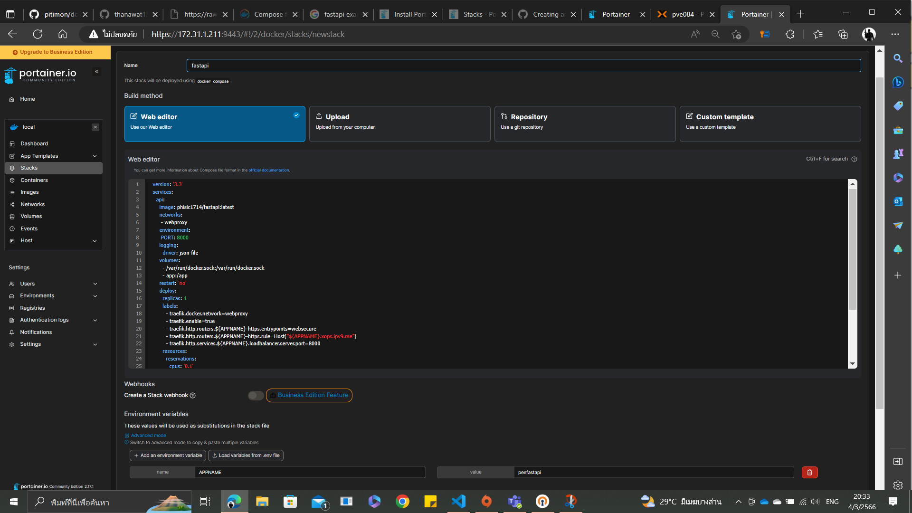
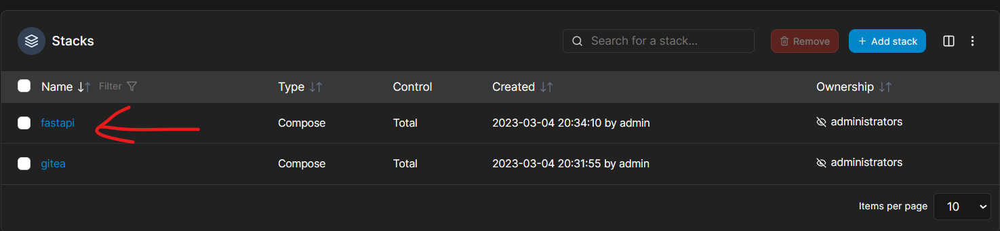

# FastAPI Web App by Docker compose and Reverse Proxy for Linux Ubuntu (FastAPI Web App โดย Docker compose และ Reverse Proxy สำหรับ Linux Ubuntu)

Hi, My name is Peerapat. I'll will show you how to compose *FastAPI web app* by Docker compose and make Reverse Proxy to create your Domain name for *FastAPI web app*         
(สวัสดีครับ ผมชื่อ พีรพัฒน์ ผมจะมาแสดงวิธีการอัพโหลด *FastAPI web app* โดย Docker compose และทำ Reverse Proxy เพื่อสร้าง ชื่อโดเมน ของคุณเองสำหรับ *FastAPI web app*)

## Preparation (การเตรียมพร้อม)
-----
1. [Install Docker Engine (ติดตั้ง Docker Engine)](https://docs.docker.com/engine/install/ubuntu/)
2. [Create Portainer CE with Docker Swarm Service easier to compose without command line and share Node to be able to work the same (สร้าง Portainer CE กับ Docker Swarm Service เพื่อง่ายต่อการ compose โดยไม่ต้องใช้ command line และสามารถแบ่ง Node ให้สามารถทำงานเหมือนกันได้)](https://docs.portainer.io/start/install-ce/server/swarm/linux)
3. [Create Traefik Service for allow to use Reverse Proxy in compose file (สร้าง Traefik Service สำหรับให้ใช้ Reverse Proxy ใน compose ไฟล์)](https://github.com/pitimon/dockerswarm-inhoure/tree/main/ep03-traefik) 
## Step 1 : Python file 
(ขั้นตอนที่ 2 : ไฟล์ Python)

---

File Path
    (ที่ตั้งไฟล์)
        
        app
        |-main.py
1. Use Python and FastAPI module template for make web app by Python. I'll explain how Python code in **main.py** work

    (ใช้ Python และ โมดูล FastAPI เป็นเท็มเพลต สำหรับเขียน web app โดย Python ผมจอธิบายการทำงานของ Python code ใน **main.py**)

    
    <details><summary>Click me!!</summary>
    
     ```ruby
     from fastapi import FastAPI 

    app = FastAPI() 
    @app.get("/") 
    async def hello_world(): 
        return {"ข้อความ(message)": "สวัสดีชาวโลก(Hello World)"} 
     
     ```
    </details>
    from this code FastAPI Module and Defind function to show this result on web app

        {"ข้อความ(message)":"สวัสดีชาวโลก(Hello World)"}
        
## Step 2 :  Dockerfile 
(ขั้นตอนที่ 2 : Dockerfile)

---
1.  Create Dockerfile you can use from this repository or Create by your own. 

    (สร้าง Dockerfile คุณสามารถ ใช้ repository นี้ หรือสร้างขึ้นมาเองได้)
    <details>
    <summary>Click me!!</summary>

    ```ruby
      # syntax = docker/dockerfile:1.4
      FROM tiangolo/uvicorn-gunicorn-fastapi:python3.9-slim AS   builder
      
      WORKDIR /app
      
      COPY requirements.txt ./
      RUN --mount=type=cache,target=/root/.cache/pip \
          pip install -r requirements.txt
      
      COPY ./app ./app
      
      FROM builder as dev-envs
      
      RUN <<EOF
      apt-get update
      apt-get install -y --no-install-recommends git
      EOF
      
      RUN <<EOF
      useradd -s /bin/bash -m vscode
      groupadd docker
      usermod -aG docker vscode
      EOF
      
      COPY --from=gloursdocker/docker / /

    ```

    </details>

2. Create requirements.txt this Text file contain this

    (สร้างไฟล์ requirements.txt Text file จะเก็บสิ่งนี้)


        fastapi
        uvicorn

    this's Python module name it will use to Dockerfile to command pip install these module.
    (นี่คือชื่อของ Python module มันจะนำมาใช้กับคำสัง pip install ใน Dockerfile)
3. Command Build to Image

    (คำสั่งให้ build เป็น image)

## Step 3 : compose.yml file 
(ขั้นตอนที่ 3 : ไฟล์ compose.yml)

---
1. Create compose file you can use compose.yml file from this repository or create by your own but I'll explain my script inside compose.yml.

    (สร้างไฟล์ compose คุณสามารถใช้ compose.yml file จาก repository นี้ หรือสร้างของคุณเอง แต่ผมจะอธิบาย script ข้างใน compose.yml)

    <details>
    <summary>Click me!!</summary>
    
    ```ruby
     version: '3.3'
     services:
       api:
         image: phisic1714/fastapi:latest		
         networks:
          - webproxy
         environment:
          PORT: 8000
         logging:
           driver: json-file
         volumes:
           - /var/run/docker.sock:/var/run/docker.sock
           - app:/app
         restart: 'no'
         deploy:
           replicas: 1
           labels:
             - traefik.docker.network=webproxy
             - traefik.enable=true
             - traefik.http.routers.${APPNAME}-https.entrypoints=websecure
             - traefik.http.routers.${APPNAME}-https.rule=Host("${APPNAME}.xops.ipv9.me")
             - traefik.http.services.${APPNAME}.loadbalancer.server.port=8000
           resources:
             reservations:
               cpus: '0.1'
               memory: 10M
             limits:
               cpus: '0.4'
               memory: 250M
               
     networks:
      webproxy:
         external: true
     volumes:
       app:

    ```
    </details>


     from my Scripts you can see this variable.
     
      (คุณเห็นตัวแปรจากที่ผมเขียนตัวนึงตามนี้)

          ${APPNAME}
     You can Edit them for your own or create .env file to setting value for this variable.
     
      (คุณสามารถแก้ไขให้เหมาะสมกับคุณ หรือ สร้างไฟล์ .env เพื่อตั้งค่าสำหรับตัวแปรที่กล่าวไว้)

2. Compose Up this compose.yml file to stack you can use this 2 optional solution 

     (ทำการ Compose Up compose.yml file นี้ไปยัง stack โดยสามารภเลือกทำได้ 2 วิธีนี้)

     - Use command line below 
     
          (ใช้คำสั่งตามนี้)

               docker stack deploy -c compose.yml fastapi

     - Use Portainer follow step below 
     
          (ใช้ portainer โดยทำตามนี้)
          - open portainer select **Stack menu** and select **Add Stack** 
          
               (เข้า portainer เลือก **เมนู stack** และ **เลือก Add Stack**)
          
          - Copy Scripts inside compose.yml file insert them in **Web editor** Text box Entry Stack name and set your enviroment variable "APPNAME" or you can change by yourself in scripts and then deploy 
          
               (คัดลอก Scripts ภายใน compose.yml file ใส่ทั้งหมดลงใน กล่องข้อความ **Web editor** ตั้งชื่อ Stack และ ตั้ง ค่าตัวแปรสภาพแวดล้อม "APPNAME" หรือ คุณสามารถ แก้ไขมันเองได้ ใน scripts จากนั้น ทำการ deploy)
          

## Result 
(ผลลัพธ์)

---
1. In Stack menu you can see your stack after deploy  that appear. 

     (ในเมนู Stack คุณจะเห็น stack หลังจากที่คุณ deploy แล้วจะแสดงขึ้นมา)

2. Inside Stack you can see status and detail of service. all of them depending on compose.yml scripts that you wrote. for my example i have two service that i set in compose.yml and now in portainer service it's shown me two service too. 

     (ข้างใน Stack คุณสามารถเห็นการแสดง สถานะ และรายละเอียดของ Service ที่ทำงาน ทั้งหมดจะขึ้นอยู่กับ compose.yml scripts ที่เราเขียนไว้ ยกตัวอย่างสำหรับผม ผมมี 2 service ซึ่ง ตั้งไว้ใน compose.yml และใน portainer ตอนนี้มันก็แสดงให้ผมเห็น 2 Services เช่นกัน)

    

3. In Image Menu you can see your Image and Tag from this menu. the tag of image come from when you build command and pulling image from your local Dockerfile.

     (ใน เมนู Image คุณสามารถเห็น Image ของคุณ และ Tag จาก เมนูนี้ โดย Tag จะได้จากการที่คุณสั่ง Build และการดึง image มาจาก Dockerfile ในเครื่องโดยตรง)
     
4.  This's my URL after Create Reverse Proxy and Deploy compose file.  

     (นี่คือ URL ของผม ที่หลังจากการสร้าง Reverse Proxy และ Deploy compose file)
     
     https://peefastapi.xops.ipv9.me
     
     The result will shown  
     (ผลลัพธ์จะแสดง)

        {"ข้อความ(message)":"สวัสดีชาวโลก(Hello World)"}

     

     


In my opinion, Dockerfile made for build your own image and set command Scripts to run or get your app file from local and use compose.yml to compose theme into network and make Reverse Proxy to easier for open web app without declare port on url and set your own Domain name.

(ในความเห็นผม Dockerfile ทำมาเพื่อสร้าง image ด้วยตัวคุณเอง และ ตั้งคำสั่งใน Script เพื่อให้ run หรือดงเอา app file จากเครื่อง local และใช้ compose.yml เพื่อ compose พวกมันไปบน network และ ทำ Reverse Proxy เพื่อง่ายต่อการเข้า web app โดยไม่ต้อง ประกาศ port ลงบน url และ ตั้งค่า Domain name ให้ตัวเอง)

-----
### Reference 
(อ้างอิง)

---
- Source Repository 
     - https://github.com/docker/awesome-compose/tree/master/fastapi
- Docker-Inhoure
     - https://github.com/pitimon/dockerswarm-inhoure
- Repository Wakatime
     - https://wakatime.com/@spcn27/projects/urblhtmmga?start=2023-02-20&end=2023-02-26

---